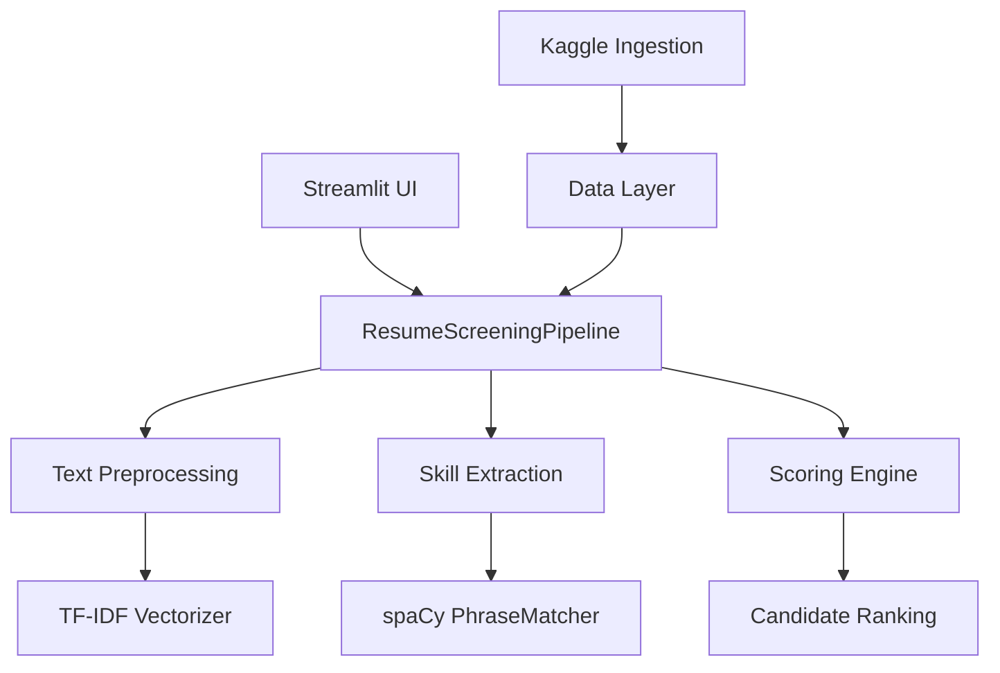
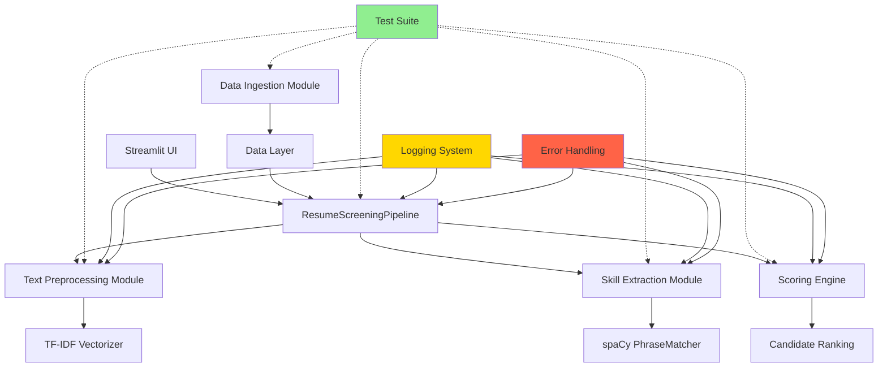
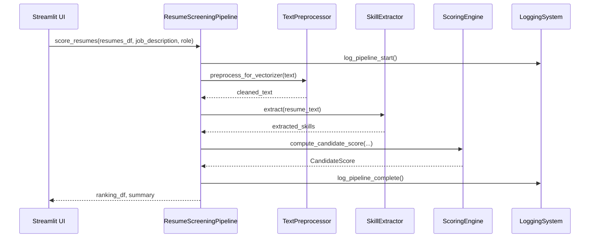

# Design Document: Production-Ready Resume Screening System Transformation

## Overview

This design outlines the comprehensive transformation of the FUTURE_ML_03 internship project into a production-ready, professionally branded AI-powered resume screening system. The transformation encompasses rebranding, comprehensive testing infrastructure, bug discovery and fixes, production-quality documentation, and code quality improvements while preserving the core NLP-based scoring algorithm (50% text similarity, 35% required skills, 15% important skills).

The system will be renamed to **ResumeScreener-AI** and will maintain its technical stack (Python 3.13+, spaCy, scikit-learn, Streamlit, Docker) while achieving enterprise-grade quality standards.

## Architecture

### Current System Architecture



### Transformed Production Architecture



## Main Algorithm/Workflow




## Components and Interfaces

### Component 1: Rebranding Module

**Purpose**: Remove all internship references and rebrand the system to ResumeScreener-AI

**Interface**:
```python
class RebrandingTransformer:
    def scan_internship_references(self, directory: Path) -> List[FileReference]
    def replace_project_name(self, old_name: str, new_name: str) -> None
    def update_documentation(self, files: List[Path]) -> None
    def rename_artifacts(self) -> None
```

**Responsibilities**:
- Scan all files for "FUTURE_ML_03", "Future Interns", "Task 3", "Machine Learning Task 3 (2026)"
- Replace with professional branding: "ResumeScreener-AI"
- Update README, ARCHITECTURE, comments, docstrings, variable names
- Rename Docker images, compose services, script names

### Component 2: Testing Infrastructure

**Purpose**: Comprehensive test coverage for all modules with unit, integration, and UI tests

**Interface**:
```python
# Unit Test Modules
class TestScoring:
    def test_compute_candidate_score_normal_case(self) -> None
    def test_compute_candidate_score_empty_skills(self) -> None
    def test_compute_candidate_score_zero_required_skills(self) -> None
    def test_safe_ratio_zero_denominator(self) -> None

class TestSkillExtraction:
    def test_extract_skills_from_text(self) -> None
    def test_skill_aliases_normalization(self) -> None
    def test_extract_empty_text(self) -> None
    def test_extract_no_skills_found(self) -> None

class TestTextPreprocessing:
    def test_clean_text(self) -> None
    def test_tokenize(self) -> None
    def test_remove_stopwords(self) -> None
    def test_preprocess_for_vectorizer(self) -> None
    def test_normalize_whitespace(self) -> None

class TestPipeline:
    def test_prepare_resumes_dataframe(self) -> None
    def test_score_resumes_end_to_end(self) -> None
    def test_pipeline_with_missing_columns(self) -> None
    def test_pipeline_with_empty_resumes(self) -> None

class TestKaggleIngestion:
    def test_map_resume_dataframe(self) -> None
    def test_map_job_dataframe(self) -> None
    def test_infer_role_key(self) -> None
    def test_normalize_column_name(self) -> None

# Integration Test Module
class TestIntegration:
    def test_full_pipeline_with_sample_data(self) -> None
    def test_streamlit_ui_workflow(self) -> None
    def test_docker_container_execution(self) -> None

# Coverage Configuration
class CoverageConfig:
    target_coverage: float = 85.0
    exclude_patterns: List[str] = ["*/tests/*", "*/venv/*"]
```

**Responsibilities**:
- Unit tests for all modules with edge cases
- Integration tests for full pipeline flows
- Streamlit UI tests using pytest-streamlit
- Docker containerization tests
- Test coverage reporting with pytest-cov
- Continuous integration setup

### Component 3: Logging System

**Purpose**: Production-grade logging infrastructure for debugging and monitoring

**Interface**:
```python
class LoggingConfig:
    log_level: str = "INFO"
    log_format: str = "%(asctime)s - %(name)s - %(levelname)s - %(message)s"
    log_file: Optional[Path] = None
    enable_console: bool = True

class PipelineLogger:
    def log_pipeline_start(self, num_resumes: int, role: str) -> None
    def log_preprocessing_complete(self, num_documents: int) -> None
    def log_skill_extraction(self, candidate_id: str, skills: Set[str]) -> None
    def log_scoring_complete(self, candidate_id: str, score: float) -> None
    def log_error(self, error: Exception, context: Dict[str, Any]) -> None
```

**Responsibilities**:
- Structured logging with timestamps
- Log levels: DEBUG, INFO, WARNING, ERROR, CRITICAL
- File and console output
- Performance metrics logging
- Error context capture

### Component 4: Error Handling Module

**Purpose**: Robust error handling with graceful degradation

**Interface**:
```python
class ResumeScreenerError(Exception):
    """Base exception for ResumeScreener-AI"""
    pass

class DataValidationError(ResumeScreenerError):
    """Raised when input data validation fails"""
    pass

class SkillExtractionError(ResumeScreenerError):
    """Raised when skill extraction fails"""
    pass

class ScoringError(ResumeScreenerError):
    """Raised when scoring computation fails"""
    pass

class ErrorHandler:
    def handle_validation_error(self, error: DataValidationError) -> ErrorResponse
    def handle_extraction_error(self, error: SkillExtractionError) -> ErrorResponse
    def handle_scoring_error(self, error: ScoringError) -> ErrorResponse
    def log_and_raise(self, error: Exception, context: Dict[str, Any]) -> None
```

**Responsibilities**:
- Custom exception hierarchy
- Graceful error handling with user-friendly messages
- Error logging with context
- Retry logic for transient failures
- Validation error details


### Component 5: Documentation System

**Purpose**: Professional, comprehensive documentation for production use

**Interface**:
```python
class DocumentationStructure:
    readme: Path  # Professional README.md with value proposition
    architecture: Path  # Enhanced ARCHITECTURE.md with diagrams
    contributing: Path  # CONTRIBUTING.md for contributors
    changelog: Path  # CHANGELOG.md for version tracking
    license: Path  # LICENSE file
    api_docs: Path  # API documentation
    deployment_guide: Path  # Deployment guides
```

**Responsibilities**:
- Professional README with clear value proposition
- Enhanced architecture documentation with Mermaid diagrams
- Contributing guidelines for open-source collaboration
- Changelog for version tracking
- API documentation with examples
- Deployment guides for Docker, Kubernetes, cloud platforms
- Code of conduct

### Component 6: Code Quality Module

**Purpose**: Improve code quality with type hints, docstrings, and best practices

**Interface**:
```python
class CodeQualityStandards:
    type_hints_coverage: float = 100.0
    docstring_coverage: float = 100.0
    max_function_length: int = 50
    max_complexity: int = 10
    
class TypeHintValidator:
    def validate_function_signatures(self, module: ModuleType) -> List[Issue]
    def validate_return_types(self, module: ModuleType) -> List[Issue]

class DocstringValidator:
    def validate_module_docstrings(self, module: ModuleType) -> List[Issue]
    def validate_function_docstrings(self, module: ModuleType) -> List[Issue]
    def validate_class_docstrings(self, module: ModuleType) -> List[Issue]
```

**Responsibilities**:
- Add type hints to all functions and methods
- Add comprehensive docstrings (Google style)
- Remove internship-related comments
- Improve variable naming
- Reduce code complexity
- Add input validation
- Improve error messages

## Data Models

### Model 1: CandidateScore (Enhanced)

```python
@dataclass
class CandidateScore:
    """Enhanced candidate scoring details with validation."""
    similarity_score: float  # 0-100
    required_skill_score: float  # 0-100
    important_skill_score: float  # 0-100
    final_fit_score: float  # 0-100
    matched_required: Set[str]
    missing_required: Set[str]
    matched_important: Set[str]
    
    def __post_init__(self) -> None:
        """Validate score ranges."""
        for score_name in ['similarity_score', 'required_skill_score', 
                           'important_skill_score', 'final_fit_score']:
            score = getattr(self, score_name)
            if not 0 <= score <= 100:
                raise ValueError(f"{score_name} must be between 0 and 100, got {score}")
    
    def to_dict(self) -> Dict[str, Any]:
        """Convert to dictionary for serialization."""
        return {
            'similarity_score': self.similarity_score,
            'required_skill_score': self.required_skill_score,
            'important_skill_score': self.important_skill_score,
            'final_fit_score': self.final_fit_score,
            'matched_required': list(self.matched_required),
            'missing_required': list(self.missing_required),
            'matched_important': list(self.matched_important),
        }
```

**Validation Rules**:
- All scores must be between 0 and 100
- Skill sets must be non-null
- Final fit score must match weighted calculation

### Model 2: TestConfiguration

```python
@dataclass
class TestConfiguration:
    """Configuration for test execution."""
    test_directory: Path = Path("tests")
    coverage_threshold: float = 85.0
    pytest_args: List[str] = field(default_factory=lambda: ["-v", "--cov=src", "--cov-report=html"])
    integration_test_timeout: int = 300  # seconds
    unit_test_timeout: int = 30  # seconds
```

### Model 3: LoggingConfiguration

```python
@dataclass
class LoggingConfiguration:
    """Configuration for logging system."""
    log_level: str = "INFO"
    log_format: str = "%(asctime)s - %(name)s - %(levelname)s - %(message)s"
    log_file: Optional[Path] = None
    enable_console: bool = True
    enable_file: bool = True
    max_file_size: int = 10 * 1024 * 1024  # 10 MB
    backup_count: int = 5
```

### Model 4: RebrandingConfiguration

```python
@dataclass
class RebrandingConfiguration:
    """Configuration for rebranding transformation."""
    old_project_name: str = "FUTURE_ML_03"
    new_project_name: str = "ResumeScreener-AI"
    old_references: List[str] = field(default_factory=lambda: [
        "FUTURE_ML_03",
        "Future Interns",
        "Task 3",
        "Machine Learning Task 3 (2026)",
        "future-ml-task3",
        "task3",
    ])
    exclude_patterns: List[str] = field(default_factory=lambda: [
        "*.pyc",
        "__pycache__",
        ".git",
        "venv",
        ".venv",
    ])
```


## Key Functions with Formal Specifications

### Function 1: compute_candidate_score() (Enhanced)

```python
def compute_candidate_score(
    similarity: float,
    resume_skills: Iterable[str],
    required_skills: Iterable[str],
    important_skills: Iterable[str],
    similarity_weight: float,
    required_weight: float,
    important_weight: float,
) -> CandidateScore:
    """
    Compute explainable component scores and final weighted score.
    
    Args:
        similarity: Cosine similarity score (0.0 to 1.0)
        resume_skills: Skills extracted from candidate's resume
        required_skills: Required skills for the role
        important_skills: Important (nice-to-have) skills for the role
        similarity_weight: Weight for similarity score (default: 0.50)
        required_weight: Weight for required skills score (default: 0.35)
        important_weight: Weight for important skills score (default: 0.15)
    
    Returns:
        CandidateScore object with all scoring details
    
    Raises:
        ValueError: If weights don't sum to 1.0 or scores are out of range
    """
```

**Preconditions:**
- `similarity` is a float between 0.0 and 1.0
- `resume_skills`, `required_skills`, `important_skills` are non-null iterables
- `similarity_weight + required_weight + important_weight == 1.0`
- All weights are non-negative floats

**Postconditions:**
- Returns valid CandidateScore object
- All component scores are between 0 and 100
- `final_fit_score = (similarity_weight * similarity_score) + (required_weight * required_skill_score) + (important_weight * important_skill_score)`
- `matched_required = resume_skills ∩ required_skills`
- `missing_required = required_skills - resume_skills`
- `matched_important = resume_skills ∩ important_skills`

**Loop Invariants:** N/A (no loops in function)

### Function 2: extract_skills() (Enhanced)

```python
def extract(self, text: str) -> Set[str]:
    """
    Extract normalized skills from text using curated skill catalog.
    
    Args:
        text: Input text (resume, job description, etc.)
    
    Returns:
        Set of normalized skill names found in text
    
    Raises:
        SkillExtractionError: If spaCy processing fails
    """
```

**Preconditions:**
- `text` is a non-null string (may be empty)
- spaCy model is loaded and PhraseMatcher is initialized
- SKILL_CATALOG and SKILL_ALIASES are properly configured

**Postconditions:**
- Returns a set of lowercase, normalized skill strings
- All returned skills exist in SKILL_CATALOG or SKILL_ALIASES
- Empty text returns empty set (no exception)
- Skills are canonicalized using SKILL_ALIASES mapping

**Loop Invariants:**
- For each match in PhraseMatcher results: extracted skill is in SKILL_CATALOG

### Function 3: preprocess_for_vectorizer() (Enhanced)

```python
def preprocess_for_vectorizer(text: str, use_stemming: bool = False) -> str:
    """
    Convert raw text into normalized text suitable for TF-IDF vectorization.
    
    Args:
        text: Raw input text
        use_stemming: Whether to apply stemming (default: False)
    
    Returns:
        Preprocessed text string ready for vectorization
    
    Raises:
        TextPreprocessingError: If preprocessing fails
    """
```

**Preconditions:**
- `text` is a non-null string (may be empty)
- NLTK tokenizer and stemmer are initialized
- STOPWORDS set is loaded

**Postconditions:**
- Returns a string with space-separated tokens
- All tokens are lowercase
- Stopwords are removed
- Tokens are stemmed if `use_stemming=True`
- Empty text returns empty string
- No special characters except alphanumeric, +, #, -, .

**Loop Invariants:**
- All processed tokens are not in STOPWORDS
- All processed tokens have length > 1

### Function 4: score_resumes() (Enhanced)

```python
def score_resumes(
    self,
    resumes_df: pd.DataFrame,
    job_description: str,
    role: str,
) -> Tuple[pd.DataFrame, Dict[str, object]]:
    """
    Compute ranking dataframe and explainable summary.
    
    Args:
        resumes_df: DataFrame with 'resume_text' column
        job_description: Job description text
        role: Role key (e.g., 'data_scientist')
    
    Returns:
        Tuple of (ranking_df, summary_dict)
    
    Raises:
        DataValidationError: If required columns are missing
        ScoringError: If scoring computation fails
    """
```

**Preconditions:**
- `resumes_df` contains 'resume_text' column
- `job_description` is non-empty string
- `role` exists in ROLE_PROFILES
- All resume_text values are strings (may be empty)

**Postconditions:**
- Returns ranking_df sorted by final_fit_score (descending)
- ranking_df contains columns: rank, candidate_id, candidate_name, final_fit_score, similarity_score, required_skill_score, important_skill_score, matched_required_skills, matched_important_skills, missing_required_skills
- summary contains: role, total_candidates, required_skills, important_skills, top_candidate, weights
- All scores are between 0 and 100
- Rank column starts at 1 and increments by 1

**Loop Invariants:**
- For each resume processed: CandidateScore is valid
- All processed resumes appear exactly once in ranking_df


## Algorithmic Pseudocode

### Main Transformation Algorithm

```pascal
ALGORITHM transform_to_production_system(project_root)
INPUT: project_root of type Path
OUTPUT: transformed_system of type ProductionSystem

BEGIN
  ASSERT project_root.exists() AND project_root.is_dir()
  
  // Phase 1: Rebranding
  rebranding_config ← RebrandingConfiguration()
  references ← scan_internship_references(project_root, rebranding_config)
  
  FOR each file_ref IN references DO
    ASSERT file_ref.file_path.exists()
    replace_in_file(file_ref.file_path, rebranding_config.old_references, rebranding_config.new_project_name)
  END FOR
  
  // Phase 2: Testing Infrastructure
  test_dir ← project_root / "tests"
  create_directory(test_dir)
  
  modules ← ["scoring", "skill_extraction", "text_preprocessing", "pipeline", "kaggle_ingestion"]
  FOR each module IN modules DO
    test_file ← test_dir / f"test_{module}.py"
    generate_unit_tests(module, test_file)
  END FOR
  
  integration_test_file ← test_dir / "test_integration.py"
  generate_integration_tests(integration_test_file)
  
  // Phase 3: Run Tests and Discover Bugs
  test_results ← run_test_suite(test_dir)
  bugs ← extract_failures(test_results)
  
  FOR each bug IN bugs DO
    fix_bug(bug)
    verify_fix(bug)
  END FOR
  
  // Phase 4: Add Logging
  logging_config ← LoggingConfiguration()
  FOR each module IN modules DO
    add_logging_to_module(module, logging_config)
  END FOR
  
  // Phase 5: Add Error Handling
  FOR each module IN modules DO
    add_error_handling_to_module(module)
  END FOR
  
  // Phase 6: Enhance Documentation
  docs ← ["README.md", "ARCHITECTURE.md", "CONTRIBUTING.md", "CHANGELOG.md", "LICENSE"]
  FOR each doc IN docs DO
    IF doc = "README.md" OR doc = "ARCHITECTURE.md" THEN
      enhance_existing_doc(project_root / doc)
    ELSE
      create_new_doc(project_root / doc)
    END IF
  END FOR
  
  // Phase 7: Code Quality Improvements
  FOR each module IN modules DO
    add_type_hints(module)
    add_docstrings(module)
    validate_code_quality(module)
  END FOR
  
  // Phase 8: Final Validation
  final_test_results ← run_test_suite(test_dir)
  coverage ← calculate_coverage(final_test_results)
  
  ASSERT coverage >= 85.0
  ASSERT final_test_results.all_passed()
  
  RETURN ProductionSystem(project_root, coverage, final_test_results)
END
```

**Preconditions:**
- project_root exists and is a directory
- project_root contains valid Python project structure
- All required dependencies are installed

**Postconditions:**
- All internship references are removed
- Test coverage >= 85%
- All tests pass
- All modules have type hints and docstrings
- Documentation is complete and professional
- Logging and error handling are implemented

**Loop Invariants:**
- All processed files remain valid Python code
- All tests remain executable throughout transformation

### Test Generation Algorithm

```pascal
ALGORITHM generate_unit_tests(module_name, output_file)
INPUT: module_name of type String, output_file of type Path
OUTPUT: test_file of type Path

BEGIN
  module ← import_module(f"src.{module_name}")
  functions ← extract_public_functions(module)
  classes ← extract_public_classes(module)
  
  test_content ← generate_test_header(module_name)
  
  // Generate tests for functions
  FOR each function IN functions DO
    test_cases ← infer_test_cases(function)
    
    FOR each test_case IN test_cases DO
      test_method ← generate_test_method(function, test_case)
      test_content ← test_content + test_method
    END FOR
  END FOR
  
  // Generate tests for classes
  FOR each class IN classes DO
    methods ← extract_public_methods(class)
    
    FOR each method IN methods DO
      test_cases ← infer_test_cases(method)
      
      FOR each test_case IN test_cases DO
        test_method ← generate_test_method(method, test_case)
        test_content ← test_content + test_method
      END FOR
    END FOR
  END FOR
  
  write_file(output_file, test_content)
  
  RETURN output_file
END
```

**Preconditions:**
- module_name is a valid Python module in src/
- output_file parent directory exists

**Postconditions:**
- output_file contains valid pytest test code
- All public functions and methods have at least one test
- Tests cover normal cases, edge cases, and error cases

**Loop Invariants:**
- test_content remains valid Python code
- All generated test methods are unique

### Bug Discovery and Fix Algorithm

```pascal
ALGORITHM discover_and_fix_bugs(test_results)
INPUT: test_results of type TestResults
OUTPUT: fixed_bugs of type List[BugFix]

BEGIN
  bugs ← []
  
  FOR each failure IN test_results.failures DO
    bug ← analyze_failure(failure)
    
    IF bug.is_fixable() THEN
      fix ← generate_fix(bug)
      apply_fix(fix)
      
      // Verify fix
      retest_result ← run_single_test(failure.test_name)
      
      IF retest_result.passed() THEN
        bugs.append(BugFix(bug, fix, "fixed"))
      ELSE
        bugs.append(BugFix(bug, fix, "failed"))
      END IF
    ELSE
      bugs.append(BugFix(bug, None, "manual_review_required"))
    END IF
  END FOR
  
  RETURN bugs
END
```

**Preconditions:**
- test_results contains at least one failure
- All test failures are reproducible

**Postconditions:**
- All fixable bugs are fixed and verified
- Unfixable bugs are flagged for manual review
- All fixes maintain backward compatibility

**Loop Invariants:**
- All previously fixed bugs remain fixed
- No new bugs are introduced by fixes


## Example Usage

### Example 1: Running the Transformed System

```python
# Import the production-ready system
from resumescreener_ai.pipeline import ResumeScreeningPipeline
from resumescreener_ai.config import ROLE_PROFILES
import pandas as pd

# Initialize pipeline with logging
pipeline = ResumeScreeningPipeline(log_level="INFO")

# Load resumes
resumes_df = pd.read_csv("data/resumes.csv")

# Define job description
job_description = """
We are seeking a Data Scientist with strong Python and machine learning skills.
Required: Python, SQL, statistics, machine learning, pandas, scikit-learn.
Nice to have: deep learning, NLP, AWS, Docker.
"""

# Score and rank candidates
ranking_df, summary = pipeline.score_resumes(
    resumes_df=resumes_df,
    job_description=job_description,
    role="data_scientist"
)

# Display results
print(f"Top candidate: {summary['top_candidate']}")
print(f"Total candidates: {summary['total_candidates']}")
print(ranking_df.head(10))
```

### Example 2: Running Tests

```bash
# Run all tests with coverage
pytest tests/ -v --cov=src --cov-report=html --cov-report=term

# Run specific test module
pytest tests/test_scoring.py -v

# Run integration tests only
pytest tests/test_integration.py -v

# Run with specific markers
pytest -m "unit" -v
pytest -m "integration" -v
```

### Example 3: Using the Logging System

```python
from resumescreener_ai.logging import setup_logging, get_logger

# Setup logging
setup_logging(
    log_level="INFO",
    log_file="logs/resumescreener.log",
    enable_console=True
)

# Get logger for module
logger = get_logger(__name__)

# Log events
logger.info("Starting resume screening pipeline")
logger.debug(f"Processing {len(resumes_df)} resumes")
logger.warning("Missing required skill: Python")
logger.error("Failed to extract skills", exc_info=True)
```

### Example 4: Error Handling

```python
from resumescreener_ai.pipeline import ResumeScreeningPipeline
from resumescreener_ai.exceptions import DataValidationError, ScoringError

pipeline = ResumeScreeningPipeline()

try:
    ranking_df, summary = pipeline.score_resumes(
        resumes_df=invalid_df,
        job_description=job_description,
        role="data_scientist"
    )
except DataValidationError as e:
    print(f"Validation error: {e}")
    print(f"Missing columns: {e.missing_columns}")
except ScoringError as e:
    print(f"Scoring error: {e}")
    print(f"Failed candidate: {e.candidate_id}")
except Exception as e:
    print(f"Unexpected error: {e}")
```

## Correctness Properties

### Property 1: Score Range Validity

**Universal Quantification:**
```
∀ candidate ∈ candidates:
  0 ≤ candidate.similarity_score ≤ 100 ∧
  0 ≤ candidate.required_skill_score ≤ 100 ∧
  0 ≤ candidate.important_skill_score ≤ 100 ∧
  0 ≤ candidate.final_fit_score ≤ 100
```

**Test Implementation:**
```python
def test_score_range_validity(sample_resumes, sample_job_description):
    """All scores must be between 0 and 100."""
    pipeline = ResumeScreeningPipeline()
    ranking_df, _ = pipeline.score_resumes(
        resumes_df=sample_resumes,
        job_description=sample_job_description,
        role="data_scientist"
    )
    
    for col in ['similarity_score', 'required_skill_score', 
                'important_skill_score', 'final_fit_score']:
        assert (ranking_df[col] >= 0).all()
        assert (ranking_df[col] <= 100).all()
```

### Property 2: Ranking Monotonicity

**Universal Quantification:**
```
∀ i, j ∈ [1, n] where i < j:
  ranking_df[i].final_fit_score ≥ ranking_df[j].final_fit_score
```

**Test Implementation:**
```python
def test_ranking_monotonicity(sample_resumes, sample_job_description):
    """Candidates must be ranked in descending order by final_fit_score."""
    pipeline = ResumeScreeningPipeline()
    ranking_df, _ = pipeline.score_resumes(
        resumes_df=sample_resumes,
        job_description=sample_job_description,
        role="data_scientist"
    )
    
    scores = ranking_df['final_fit_score'].tolist()
    assert scores == sorted(scores, reverse=True)
```

### Property 3: Skill Matching Correctness

**Universal Quantification:**
```
∀ candidate ∈ candidates:
  candidate.matched_required = candidate.resume_skills ∩ required_skills ∧
  candidate.missing_required = required_skills - candidate.resume_skills ∧
  candidate.matched_required ∩ candidate.missing_required = ∅
```

**Test Implementation:**
```python
def test_skill_matching_correctness():
    """Matched and missing skills must be disjoint and complete."""
    resume_skills = {"python", "sql", "pandas"}
    required_skills = {"python", "sql", "machine learning"}
    
    score = compute_candidate_score(
        similarity=0.8,
        resume_skills=resume_skills,
        required_skills=required_skills,
        important_skills=set(),
        similarity_weight=0.5,
        required_weight=0.35,
        important_weight=0.15
    )
    
    assert score.matched_required == {"python", "sql"}
    assert score.missing_required == {"machine learning"}
    assert score.matched_required.isdisjoint(score.missing_required)
```

### Property 4: Weight Conservation

**Universal Quantification:**
```
∀ candidate ∈ candidates:
  candidate.final_fit_score = 
    (similarity_weight × candidate.similarity_score) +
    (required_weight × candidate.required_skill_score) +
    (important_weight × candidate.important_skill_score)
  
  where similarity_weight + required_weight + important_weight = 1.0
```

**Test Implementation:**
```python
def test_weight_conservation():
    """Final score must equal weighted sum of component scores."""
    similarity = 0.8
    required_coverage = 0.6
    important_coverage = 0.4
    
    score = compute_candidate_score(
        similarity=similarity,
        resume_skills={"python", "sql"},
        required_skills={"python", "sql", "ml"},
        important_skills={"docker", "aws"},
        similarity_weight=0.5,
        required_weight=0.35,
        important_weight=0.15
    )
    
    expected = (0.5 * 80.0) + (0.35 * 66.67) + (0.15 * 50.0)
    assert abs(score.final_fit_score - expected) < 0.1
```

### Property 5: Test Coverage Threshold

**Universal Quantification:**
```
coverage(test_suite) ≥ 85.0%
```

**Test Implementation:**
```python
def test_coverage_threshold():
    """Test coverage must meet minimum threshold."""
    result = subprocess.run(
        ["pytest", "--cov=src", "--cov-report=json"],
        capture_output=True
    )
    
    with open("coverage.json") as f:
        coverage_data = json.load(f)
    
    total_coverage = coverage_data["totals"]["percent_covered"]
    assert total_coverage >= 85.0
```


## Error Handling

### Error Scenario 1: Missing Required Columns

**Condition**: Input DataFrame is missing 'resume_text' column
**Response**: Raise DataValidationError with clear message listing missing columns
**Recovery**: User must provide DataFrame with required columns

```python
class DataValidationError(ResumeScreenerError):
    def __init__(self, missing_columns: List[str]):
        self.missing_columns = missing_columns
        super().__init__(f"Missing required columns: {', '.join(missing_columns)}")
```

### Error Scenario 2: Empty Resume Text

**Condition**: Resume text is empty or contains only whitespace
**Response**: Log warning and assign zero scores for that candidate
**Recovery**: Continue processing other candidates, include in results with zero scores

```python
def _handle_empty_resume(self, candidate_id: str) -> CandidateScore:
    self.logger.warning(f"Empty resume text for candidate {candidate_id}")
    return CandidateScore(
        similarity_score=0.0,
        required_skill_score=0.0,
        important_skill_score=0.0,
        final_fit_score=0.0,
        matched_required=set(),
        missing_required=set(self.required_skills),
        matched_important=set()
    )
```

### Error Scenario 3: Invalid Role Key

**Condition**: Specified role does not exist in ROLE_PROFILES
**Response**: Raise ValueError with list of valid roles
**Recovery**: User must provide valid role key

```python
def _validate_role(self, role: str) -> None:
    if role not in ROLE_PROFILES:
        valid_roles = ", ".join(sorted(ROLE_PROFILES.keys()))
        raise ValueError(
            f"Invalid role '{role}'. Valid roles: {valid_roles}"
        )
```

### Error Scenario 4: spaCy Model Not Found

**Condition**: spaCy model is not installed or cannot be loaded
**Response**: Raise SkillExtractionError with installation instructions
**Recovery**: User must install spaCy model: `python -m spacy download en_core_web_sm`

```python
class SkillExtractionError(ResumeScreenerError):
    def __init__(self, message: str):
        super().__init__(
            f"{message}\n"
            "Install spaCy model: python -m spacy download en_core_web_sm"
        )
```

### Error Scenario 5: Test Failure

**Condition**: Test fails during execution
**Response**: Log detailed error with stack trace, mark test as failed
**Recovery**: Analyze failure, fix bug, re-run test

```python
def handle_test_failure(test_name: str, error: Exception) -> None:
    logger.error(f"Test failed: {test_name}")
    logger.error(f"Error: {error}", exc_info=True)
    
    # Create bug report
    bug_report = {
        "test_name": test_name,
        "error_type": type(error).__name__,
        "error_message": str(error),
        "timestamp": datetime.now().isoformat(),
        "stack_trace": traceback.format_exc()
    }
    
    # Save bug report
    with open(f"bugs/{test_name}.json", "w") as f:
        json.dump(bug_report, f, indent=2)
```

### Error Scenario 6: Docker Build Failure

**Condition**: Docker image build fails
**Response**: Log build output, identify missing dependencies or syntax errors
**Recovery**: Fix Dockerfile, update requirements.txt, rebuild

```python
def handle_docker_build_failure(build_output: str) -> None:
    logger.error("Docker build failed")
    logger.error(f"Build output:\n{build_output}")
    
    # Parse common errors
    if "requirements.txt" in build_output:
        logger.error("Check requirements.txt for invalid dependencies")
    elif "COPY" in build_output:
        logger.error("Check COPY commands for missing files")
    elif "RUN" in build_output:
        logger.error("Check RUN commands for syntax errors")
```

## Testing Strategy

### Unit Testing Approach

**Objective**: Test individual functions and methods in isolation

**Coverage Goals**:
- 100% coverage of public functions
- 90%+ coverage of private functions
- All edge cases covered

**Test Structure**:
```
tests/
├── unit/
│   ├── test_scoring.py
│   ├── test_skill_extraction.py
│   ├── test_text_preprocessing.py
│   ├── test_pipeline.py
│   └── test_kaggle_ingestion.py
├── integration/
│   ├── test_full_pipeline.py
│   ├── test_streamlit_ui.py
│   └── test_docker.py
├── fixtures/
│   ├── sample_resumes.csv
│   ├── sample_job_description.txt
│   └── conftest.py
└── conftest.py
```

**Key Test Cases**:

1. **Scoring Module** (`test_scoring.py`):
   - Normal case with valid inputs
   - Empty skills sets
   - Zero required skills (edge case)
   - Zero denominator in ratio calculation
   - Invalid score ranges
   - Weight validation

2. **Skill Extraction Module** (`test_skill_extraction.py`):
   - Extract skills from normal text
   - Skill alias normalization
   - Empty text input
   - No skills found
   - Case insensitivity
   - Special characters in skills (C++, C#)

3. **Text Preprocessing Module** (`test_text_preprocessing.py`):
   - Clean text with special characters
   - Tokenization with technical terms
   - Stopword removal
   - Stemming
   - Empty text
   - Unicode handling

4. **Pipeline Module** (`test_pipeline.py`):
   - Prepare resumes dataframe
   - Score resumes end-to-end
   - Missing columns error
   - Empty resumes handling
   - Invalid role key
   - File I/O with retry logic

5. **Kaggle Ingestion Module** (`test_kaggle_ingestion.py`):
   - Map resume dataframe
   - Map job dataframe
   - Infer role key
   - Normalize column names
   - Handle missing columns
   - Archive extraction

### Property-Based Testing Approach

**Property Test Library**: Hypothesis (Python)

**Key Properties to Test**:

1. **Score Invariants**:
```python
from hypothesis import given, strategies as st

@given(
    similarity=st.floats(min_value=0.0, max_value=1.0),
    resume_skills=st.sets(st.text(min_size=1, max_size=20)),
    required_skills=st.sets(st.text(min_size=1, max_size=20)),
    important_skills=st.sets(st.text(min_size=1, max_size=20))
)
def test_score_range_property(similarity, resume_skills, required_skills, important_skills):
    """All scores must be in valid range regardless of input."""
    score = compute_candidate_score(
        similarity=similarity,
        resume_skills=resume_skills,
        required_skills=required_skills,
        important_skills=important_skills,
        similarity_weight=0.5,
        required_weight=0.35,
        important_weight=0.15
    )
    
    assert 0 <= score.similarity_score <= 100
    assert 0 <= score.required_skill_score <= 100
    assert 0 <= score.important_skill_score <= 100
    assert 0 <= score.final_fit_score <= 100
```

2. **Skill Extraction Idempotency**:
```python
@given(text=st.text(min_size=0, max_size=1000))
def test_skill_extraction_idempotency(text):
    """Extracting skills twice should give same result."""
    extractor = SkillExtractor()
    skills1 = extractor.extract(text)
    skills2 = extractor.extract(text)
    assert skills1 == skills2
```

3. **Preprocessing Consistency**:
```python
@given(text=st.text(min_size=0, max_size=1000))
def test_preprocessing_consistency(text):
    """Preprocessing should be deterministic."""
    result1 = preprocess_for_vectorizer(text)
    result2 = preprocess_for_vectorizer(text)
    assert result1 == result2
```

### Integration Testing Approach

**Objective**: Test complete workflows and component interactions

**Key Integration Tests**:

1. **Full Pipeline Test**:
```python
def test_full_pipeline_with_sample_data():
    """Test complete pipeline from CSV to ranking."""
    pipeline = ResumeScreeningPipeline()
    
    resumes_df = pd.read_csv("tests/fixtures/sample_resumes.csv")
    job_description = Path("tests/fixtures/sample_job_description.txt").read_text()
    
    ranking_df, summary = pipeline.score_resumes(
        resumes_df=resumes_df,
        job_description=job_description,
        role="data_scientist"
    )
    
    assert len(ranking_df) == len(resumes_df)
    assert summary["total_candidates"] == len(resumes_df)
    assert "top_candidate" in summary
    assert ranking_df["rank"].tolist() == list(range(1, len(ranking_df) + 1))
```

2. **Streamlit UI Test**:
```python
def test_streamlit_ui_workflow():
    """Test Streamlit UI components."""
    from streamlit.testing.v1 import AppTest
    
    at = AppTest.from_file("streamlit_app.py")
    at.run()
    
    # Check UI elements exist
    assert at.title[0].value == "Recruiter Resume Screening Dashboard"
    assert at.selectbox[0].label == "Target role"
    assert at.button[0].label == "Run Screening"
```

3. **Docker Container Test**:
```python
def test_docker_container_execution():
    """Test Docker container builds and runs successfully."""
    # Build image
    build_result = subprocess.run(
        ["docker", "build", "-t", "resumescreener-ai-test", "."],
        capture_output=True
    )
    assert build_result.returncode == 0
    
    # Run container
    run_result = subprocess.run(
        ["docker", "run", "--rm", "resumescreener-ai-test"],
        capture_output=True,
        timeout=60
    )
    assert run_result.returncode == 0
```


## Performance Considerations

### 1. TF-IDF Vectorization Performance

**Challenge**: Vectorizing large numbers of resumes can be slow

**Optimization Strategy**:
- Use sparse matrices for TF-IDF vectors
- Cache vectorizer for repeated use
- Batch process resumes in chunks of 100-500
- Use `min_df` parameter to filter rare terms

**Implementation**:
```python
class OptimizedPipeline:
    def __init__(self, batch_size: int = 100):
        self.batch_size = batch_size
        self.vectorizer_cache = {}
    
    def score_resumes_batched(self, resumes_df: pd.DataFrame, 
                               job_description: str, role: str):
        """Process resumes in batches for better performance."""
        results = []
        for i in range(0, len(resumes_df), self.batch_size):
            batch = resumes_df.iloc[i:i+self.batch_size]
            batch_results = self._score_batch(batch, job_description, role)
            results.append(batch_results)
        return pd.concat(results)
```

### 2. Skill Extraction Performance

**Challenge**: spaCy PhraseMatcher can be slow on long documents

**Optimization Strategy**:
- Limit document length to first 5000 characters
- Use spaCy's `nlp.pipe()` for batch processing
- Disable unnecessary pipeline components
- Cache extracted skills per resume

**Implementation**:
```python
class OptimizedSkillExtractor:
    def __init__(self, max_doc_length: int = 5000):
        self.nlp = spacy.blank("en")
        self.max_doc_length = max_doc_length
        self.cache = {}
    
    def extract_batch(self, texts: List[str]) -> List[Set[str]]:
        """Extract skills from multiple texts efficiently."""
        truncated = [text[:self.max_doc_length] for text in texts]
        docs = self.nlp.pipe(truncated, batch_size=50)
        return [self._extract_from_doc(doc) for doc in docs]
```

### 3. Memory Usage

**Challenge**: Loading large datasets into memory

**Optimization Strategy**:
- Use pandas chunking for large CSV files
- Stream processing for very large datasets
- Clear intermediate results after use
- Use generators where possible

**Implementation**:
```python
def load_resumes_chunked(file_path: Path, chunk_size: int = 1000):
    """Load resumes in chunks to reduce memory usage."""
    for chunk in pd.read_csv(file_path, chunksize=chunk_size):
        yield chunk
```

### 4. Caching Strategy

**Challenge**: Repeated processing of same data

**Optimization Strategy**:
- Cache preprocessed text
- Cache extracted skills
- Cache TF-IDF vectors
- Use LRU cache for frequently accessed data

**Implementation**:
```python
from functools import lru_cache

@lru_cache(maxsize=1000)
def preprocess_cached(text: str) -> str:
    """Cached version of preprocessing."""
    return preprocess_for_vectorizer(text)
```

### 5. Parallel Processing

**Challenge**: Sequential processing is slow for large datasets

**Optimization Strategy**:
- Use multiprocessing for CPU-bound tasks
- Parallel skill extraction
- Parallel preprocessing
- Thread pool for I/O operations

**Implementation**:
```python
from concurrent.futures import ProcessPoolExecutor

def extract_skills_parallel(texts: List[str], n_workers: int = 4) -> List[Set[str]]:
    """Extract skills in parallel."""
    extractor = SkillExtractor()
    with ProcessPoolExecutor(max_workers=n_workers) as executor:
        results = list(executor.map(extractor.extract, texts))
    return results
```

## Security Considerations

### 1. Input Validation

**Threat**: Malicious input data (SQL injection, XSS, code injection)

**Mitigation**:
- Validate all input data types and formats
- Sanitize text inputs
- Limit input sizes
- Use parameterized queries if database is added

**Implementation**:
```python
def validate_resume_text(text: str) -> str:
    """Validate and sanitize resume text."""
    if not isinstance(text, str):
        raise DataValidationError("Resume text must be string")
    
    if len(text) > 100000:  # 100KB limit
        raise DataValidationError("Resume text exceeds maximum length")
    
    # Remove potentially dangerous characters
    sanitized = re.sub(r'[<>{}]', '', text)
    return sanitized
```

### 2. File Upload Security

**Threat**: Malicious file uploads (malware, path traversal)

**Mitigation**:
- Validate file extensions
- Scan file contents
- Limit file sizes
- Use secure file handling

**Implementation**:
```python
ALLOWED_EXTENSIONS = {'.csv', '.txt'}
MAX_FILE_SIZE = 10 * 1024 * 1024  # 10 MB

def validate_uploaded_file(file_path: Path) -> None:
    """Validate uploaded file for security."""
    if file_path.suffix.lower() not in ALLOWED_EXTENSIONS:
        raise SecurityError(f"File type not allowed: {file_path.suffix}")
    
    if file_path.stat().st_size > MAX_FILE_SIZE:
        raise SecurityError("File size exceeds maximum")
    
    # Check for path traversal
    if '..' in str(file_path):
        raise SecurityError("Invalid file path")
```

### 3. Dependency Security

**Threat**: Vulnerable dependencies

**Mitigation**:
- Pin dependency versions
- Regular security audits with `pip-audit`
- Use Dependabot for automated updates
- Review dependency licenses

**Implementation**:
```bash
# requirements.txt with pinned versions
pandas==2.2.3
numpy==2.1.3
scikit-learn==1.5.2
spacy==3.8.7

# Security audit
pip-audit

# Update dependencies safely
pip list --outdated
```

### 4. API Security (Future)

**Threat**: Unauthorized API access, rate limiting

**Mitigation**:
- Implement API authentication (JWT tokens)
- Rate limiting per user/IP
- Input validation on all endpoints
- HTTPS only

**Implementation**:
```python
from fastapi import FastAPI, Depends, HTTPException
from fastapi.security import HTTPBearer

security = HTTPBearer()

@app.post("/api/score-resumes")
async def score_resumes_api(
    request: ScoringRequest,
    token: str = Depends(security)
):
    """API endpoint with authentication."""
    if not validate_token(token):
        raise HTTPException(status_code=401, detail="Invalid token")
    
    # Rate limiting
    if not check_rate_limit(token):
        raise HTTPException(status_code=429, detail="Rate limit exceeded")
    
    # Process request
    return process_scoring_request(request)
```

### 5. Data Privacy

**Threat**: Exposure of sensitive candidate information

**Mitigation**:
- Anonymize candidate data in logs
- Encrypt sensitive data at rest
- Implement data retention policies
- GDPR compliance considerations

**Implementation**:
```python
def anonymize_candidate_data(df: pd.DataFrame) -> pd.DataFrame:
    """Anonymize candidate information for logging."""
    anonymized = df.copy()
    
    # Hash candidate names
    anonymized['candidate_name'] = anonymized['candidate_name'].apply(
        lambda x: hashlib.sha256(x.encode()).hexdigest()[:8]
    )
    
    # Remove PII from resume text for logs
    anonymized['resume_text_preview'] = anonymized['resume_text'].str[:100]
    anonymized = anonymized.drop(columns=['resume_text'])
    
    return anonymized
```

## Dependencies

### Core Dependencies

```
# Core ML/NLP
pandas==2.2.3
numpy==2.1.3
scikit-learn==1.5.2
spacy==3.8.7
nltk==3.9.1

# Web UI
streamlit==1.44.1

# Configuration
python-dotenv==1.0.1

# Data ingestion
kaggle==1.7.4.5
```

### Development Dependencies

```
# Testing
pytest==8.3.4
pytest-cov==6.0.0
pytest-mock==3.14.0
hypothesis==6.122.3
pytest-timeout==2.3.1

# Code quality
black==24.10.0
flake8==7.1.1
mypy==1.13.0
pylint==3.3.2
isort==5.13.2

# Documentation
mkdocs==1.6.1
mkdocs-material==9.5.47
mkdocstrings==0.27.0

# Security
pip-audit==2.7.3
bandit==1.8.0
```

### System Dependencies

```
# spaCy language model
python -m spacy download en_core_web_sm

# Docker
docker>=20.10.0
docker-compose>=2.0.0

# Git
git>=2.30.0
```

### Optional Dependencies

```
# API (future)
fastapi==0.115.6
uvicorn==0.34.0
pydantic==2.10.4

# Database (future)
sqlalchemy==2.0.36
psycopg2-binary==2.9.10

# Monitoring (future)
prometheus-client==0.21.1
sentry-sdk==2.19.2
```

## Deployment Considerations

### Docker Deployment

**Dockerfile Enhancements**:
```dockerfile
FROM python:3.13-slim

# Set working directory
WORKDIR /app

# Install system dependencies
RUN apt-get update && apt-get install -y \
    build-essential \
    && rm -rf /var/lib/apt/lists/*

# Copy requirements
COPY requirements.txt .

# Install Python dependencies
RUN pip install --no-cache-dir -r requirements.txt

# Download spaCy model
RUN python -m spacy download en_core_web_sm

# Copy application code
COPY . .

# Create non-root user
RUN useradd -m -u 1000 appuser && chown -R appuser:appuser /app
USER appuser

# Health check
HEALTHCHECK --interval=30s --timeout=10s --start-period=5s --retries=3 \
    CMD python -c "import sys; sys.exit(0)"

# Run application
CMD ["python", "-m", "src.run_pipeline"]
```

### Kubernetes Deployment (Future)

**Deployment YAML**:
```yaml
apiVersion: apps/v1
kind: Deployment
metadata:
  name: resumescreener-ai
spec:
  replicas: 3
  selector:
    matchLabels:
      app: resumescreener-ai
  template:
    metadata:
      labels:
        app: resumescreener-ai
    spec:
      containers:
      - name: resumescreener-ai
        image: resumescreener-ai:latest
        resources:
          requests:
            memory: "512Mi"
            cpu: "500m"
          limits:
            memory: "2Gi"
            cpu: "2000m"
        env:
        - name: LOG_LEVEL
          value: "INFO"
```

### Cloud Deployment Options

1. **AWS**:
   - ECS/Fargate for containerized deployment
   - S3 for data storage
   - CloudWatch for logging
   - Lambda for serverless API

2. **Google Cloud**:
   - Cloud Run for containerized deployment
   - Cloud Storage for data
   - Cloud Logging for logs
   - Cloud Functions for serverless

3. **Azure**:
   - Container Instances for deployment
   - Blob Storage for data
   - Application Insights for monitoring
   - Azure Functions for serverless

