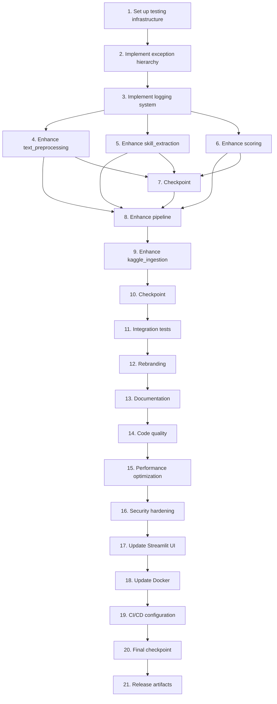

# Implementation Plan: Production-Ready Resume Screening System Transformation

## Overview

This implementation plan transforms the FUTURE_ML_03 internship project into ResumeScreener-AI, a production-ready resume screening system. The transformation includes comprehensive rebranding, testing infrastructure, bug fixes, logging, error handling, documentation, and code quality improvements while preserving the core NLP-based scoring algorithm (50% similarity, 35% required skills, 15% important skills).

## Task Dependency Graph



```json
{
  "waves": [
    {
      "name": "Foundation",
      "tasks": [1, 2, 3]
    },
    {
      "name": "Core Module Enhancement",
      "tasks": [4, 5, 6, 7]
    },
    {
      "name": "Pipeline & Integration",
      "tasks": [8, 9, 10, 11]
    },
    {
      "name": "Rebranding & Documentation",
      "tasks": [12, 13]
    },
    {
      "name": "Quality & Optimization",
      "tasks": [14, 15, 16]
    },
    {
      "name": "Deployment & Release",
      "tasks": [17, 18, 19, 20, 21]
    }
  ]
}
```

## Tasks

- [x] 1. Set up testing infrastructure and project structure
  - Create `tests/` directory with `__init__.py`
  - Install testing dependencies: pytest, pytest-cov, pytest-mock, hypothesis
  - Create `tests/conftest.py` with shared fixtures
  - Create `.coveragerc` configuration file
  - Set up pytest configuration in `pyproject.toml` or `pytest.ini`
  - _Requirements: 2.1, 2.2, 2.5_

- [x] 2. Implement custom exception hierarchy
  - [x] 2.1 Create `src/exceptions.py` with custom exception classes
    - Define `ResumeScreenerError` base exception
    - Define `DataValidationError` with missing_columns attribute
    - Define `SkillExtractionError` for skill extraction failures
    - Define `ScoringError` for scoring computation failures
    - Add docstrings and type hints to all exception classes
    - _Requirements: 5.1_
  
  - [ ]* 2.2 Write unit tests for exception hierarchy
    - Test exception instantiation and attributes
    - Test exception inheritance chain
    - Test exception message formatting
    - _Requirements: 5.1_

- [x] 3. Implement production logging system
  - [x] 3.1 Create `src/logging_config.py` with logging infrastructure
    - Define `LoggingConfiguration` dataclass
    - Implement `setup_logging()` function with file rotation
    - Implement `get_logger()` function for module-specific loggers
    - Support console and file output with configurable levels
    - Add structured logging with timestamp, level, module, context
    - _Requirements: 4.1, 4.2, 4.3, 4.6_
  
  - [ ]* 3.2 Write unit tests for logging configuration
    - Test logger initialization
    - Test log level configuration
    - Test file rotation
    - Test console and file output
    - _Requirements: 4.1, 4.2, 4.3_

- [ ] 4. Add logging and error handling to text_preprocessing module
  - [-] 4.1 Enhance `src/text_preprocessing.py` with logging and error handling
    - Add module-level logger using `get_logger(__name__)`
    - Add type hints to all functions
    - Add comprehensive docstrings (Google style)
    - Add input validation for text parameters
    - Add error handling with try-except blocks
    - Log preprocessing start, completion, and errors
    - Handle empty text gracefully
    - _Requirements: 4.1, 4.4, 4.5, 5.2, 5.3, 5.4, 7.1, 7.2_
  
  - [ ]* 4.2 Write unit tests for text_preprocessing module
    - Test `clean_text()` with normal, empty, and special character inputs
    - Test `tokenize()` with various text formats
    - Test `remove_stopwords()` with stopword-heavy text
    - Test `preprocess_for_vectorizer()` with and without stemming
    - Test error handling for invalid inputs
    - _Requirements: 2.1, 3.6_
  
  - [ ]* 4.3 Write property test for preprocessing consistency
    - **Property 3: Preprocessing Consistency**
    - For any text, preprocessing twice should yield the same result
    - **Validates: Requirements 10.3**

- [ ] 5. Add logging and error handling to skill_extraction module
  - [-] 5.1 Enhance `src/skill_extraction.py` with logging and error handling
    - Add module-level logger
    - Add type hints to all methods
    - Add comprehensive docstrings
    - Add input validation
    - Wrap spaCy processing in try-except with SkillExtractionError
    - Log skill extraction start, results, and errors
    - Handle empty text and missing spaCy model gracefully
    - _Requirements: 4.1, 4.4, 5.2, 5.3, 5.4, 7.1, 7.2_
  
  - [ ]* 5.2 Write unit tests for skill_extraction module
    - Test `extract()` with skill-rich text
    - Test `extract()` with empty text
    - Test `extract()` with no skills found
    - Test skill alias normalization
    - Test error handling for spaCy failures
    - _Requirements: 2.1, 3.6_
  
  - [ ]* 5.3 Write property test for skill extraction idempotency
    - **Property 2: Skill Extraction Idempotency**
    - For any text, extracting skills twice should yield the same result
    - **Validates: Requirements 10.2**

- [ ] 6. Add logging and error handling to scoring module
  - [ ] 6.1 Enhance `src/scoring.py` with logging and error handling
    - Add module-level logger
    - Add type hints to all functions
    - Add comprehensive docstrings
    - Add input validation for weights (must sum to 1.0)
    - Add input validation for similarity (0.0 to 1.0)
    - Wrap scoring computation in try-except with ScoringError
    - Log scoring start, component scores, and errors
    - Add `__post_init__` validation to CandidateScore dataclass
    - Add `to_dict()` method to CandidateScore
    - _Requirements: 4.1, 4.4, 5.2, 5.3, 5.4, 7.1, 7.2_
  
  - [ ]* 6.2 Write unit tests for scoring module
    - Test `compute_candidate_score()` with normal inputs
    - Test `compute_candidate_score()` with empty skill sets
    - Test `compute_candidate_score()` with zero required skills
    - Test `safe_ratio()` with zero denominator
    - Test CandidateScore validation (scores 0-100)
    - Test weight validation (must sum to 1.0)
    - Test similarity validation (0.0 to 1.0)
    - _Requirements: 2.1, 3.6_
  
  - [ ]* 6.3 Write property tests for scoring correctness
    - **Property 1: Score Range Validity**
    - For any candidate, all scores must be between 0 and 100
    - **Validates: Requirements 10.1**
    
    - **Property 3: Skill Matching Correctness**
    - For any candidate, matched and missing skills must be disjoint and complete
    - **Validates: Requirements 10.1**
    
    - **Property 4: Weight Conservation**
    - For any candidate, final score must equal weighted sum of component scores
    - **Validates: Requirements 10.1**

- [~] 7. Checkpoint - Ensure all tests pass
  - Run `pytest tests/ -v --cov=src --cov-report=term`
  - Verify all unit tests pass
  - Verify all property tests pass
  - Check test coverage is progressing toward 85%
  - Ask the user if questions arise

- [ ] 8. Add logging and error handling to pipeline module
  - [~] 8.1 Enhance `src/pipeline.py` with logging and error handling
    - Add module-level logger
    - Add type hints to all methods
    - Add comprehensive docstrings
    - Add input validation for resumes_df (must have 'resume_text' column)
    - Add input validation for role (must exist in ROLE_PROFILES)
    - Wrap pipeline execution in try-except with appropriate exceptions
    - Log pipeline start, progress, and completion
    - Log performance metrics (execution time, number of resumes)
    - Handle empty resumes gracefully (return zero scores)
    - Handle missing columns with DataValidationError
    - Handle invalid role keys with DataValidationError
    - Implement partial results on candidate failures
    - _Requirements: 4.1, 4.4, 4.5, 5.2, 5.3, 5.4, 5.5, 7.1, 7.2, 12.1, 12.4_
  
  - [ ]* 8.2 Write unit tests for pipeline module
    - Test `prepare_resumes_dataframe()` with valid DataFrame
    - Test `score_resumes()` end-to-end with sample data
    - Test pipeline with missing 'resume_text' column
    - Test pipeline with empty resumes
    - Test pipeline with invalid role key
    - Test error handling and partial results
    - _Requirements: 2.1, 3.6_
  
  - [ ]* 8.3 Write property test for ranking monotonicity
    - **Property 2: Ranking Monotonicity**
    - For any set of candidates, ranking must be in descending order by final_fit_score
    - **Validates: Requirements 10.4**

- [ ] 9. Add logging and error handling to kaggle_ingestion module
  - [~] 9.1 Enhance `src/kaggle_ingestion.py` with logging and error handling
    - Add module-level logger
    - Add type hints to all functions
    - Add comprehensive docstrings
    - Add input validation for DataFrames
    - Wrap ingestion logic in try-except blocks
    - Log ingestion start, mapping results, and errors
    - Handle missing columns gracefully
    - _Requirements: 4.1, 5.2, 5.3, 5.4, 7.1, 7.2_
  
  - [ ]* 9.2 Write unit tests for kaggle_ingestion module
    - Test `map_resume_dataframe()` with various column names
    - Test `map_job_dataframe()` with various formats
    - Test `infer_role_key()` with different role descriptions
    - Test `normalize_column_name()` with edge cases
    - Test error handling for invalid DataFrames
    - _Requirements: 2.1, 3.6_

- [~] 10. Checkpoint - Ensure all tests pass
  - Run `pytest tests/ -v --cov=src --cov-report=html`
  - Verify all unit tests pass
  - Verify all property tests pass
  - Check test coverage is at least 85%
  - Review HTML coverage report
  - Ask the user if questions arise

- [ ] 11. Implement integration tests
  - [~] 11.1 Create `tests/test_integration.py` with integration tests
    - Test full pipeline with sample CSV data
    - Test Streamlit UI workflow (if possible with pytest-streamlit)
    - Test Docker container build and execution
    - Test end-to-end flow: load data → preprocess → extract skills → score → rank
    - Add markers: `@pytest.mark.integration`
    - _Requirements: 2.3_
  
  - [ ]* 11.2 Write property test for coverage threshold
    - **Property 5: Test Coverage Threshold**
    - Test coverage must be at least 85%
    - **Validates: Requirements 2.2**

- [ ] 12. Execute comprehensive rebranding
  - [~] 12.1 Create rebranding script `scripts/rebrand.py`
    - Scan all files for internship references
    - Replace "FUTURE_ML_03" with "ResumeScreener-AI"
    - Replace "Future Interns" with professional terminology
    - Replace "Task 3" and "Machine Learning Task 3 (2026)" references
    - Update Docker image names and compose services
    - Update script names and file paths
    - Exclude .git, __pycache__, venv, .venv directories
    - _Requirements: 1.1, 1.2, 1.3, 1.4, 1.5_
  
  - [~] 12.2 Execute rebranding script
    - Run `python scripts/rebrand.py`
    - Review changes
    - Commit changes with descriptive message
    - _Requirements: 1.1, 1.2, 1.3, 1.4, 1.5_
  
  - [~] 12.3 Manually review and update README.md
    - Update project title to "ResumeScreener-AI"
    - Add professional value proposition
    - Update installation instructions
    - Add usage examples
    - Add license information
    - Remove all internship references
    - _Requirements: 1.6, 6.1, 13.3, 13.4_
  
  - [~] 12.4 Manually review and update ARCHITECTURE.md
    - Update document title
    - Add Mermaid diagrams for architecture
    - Add component descriptions
    - Add data flow diagrams
    - Document design decisions
    - Remove all internship references
    - _Requirements: 1.6, 6.2_

- [ ] 13. Create professional documentation
  - [~] 13.1 Create `CONTRIBUTING.md`
    - Add code style guidelines (PEP 8, max line length 100)
    - Add development setup instructions
    - Add testing requirements (85% coverage)
    - Add PR process and review guidelines
    - Add commit message conventions
    - _Requirements: 6.3_
  
  - [~] 13.2 Create `CHANGELOG.md`
    - Add version 1.0.0 entry
    - Document transformation from FUTURE_ML_03
    - List new features: testing, logging, error handling
    - List breaking changes (if any)
    - List bug fixes discovered during testing
    - _Requirements: 6.4_
  
  - [~] 13.3 Create `LICENSE`
    - Add MIT License (or user's preferred open-source license)
    - Update copyright year and owner
    - _Requirements: 6.5_
  
  - [~] 13.4 Create `docs/API.md`
    - Document all public functions and classes
    - Include function signatures with type hints
    - Include parameter descriptions
    - Include return value descriptions
    - Include usage examples for each function
    - _Requirements: 6.6, 13.5_
  
  - [~] 13.5 Create `docs/DEPLOYMENT.md`
    - Add local deployment instructions
    - Add Docker deployment instructions
    - Add Docker Compose deployment instructions
    - Add cloud deployment guides (AWS, GCP, Azure)
    - Add environment variable configuration
    - Add troubleshooting section
    - _Requirements: 6.7, 14.3_

- [ ] 14. Implement code quality improvements
  - [~] 14.1 Add type hints to all modules
    - Review `src/config.py` and add type hints
    - Review `src/run_pipeline.py` and add type hints
    - Review `streamlit_app.py` and add type hints
    - Ensure all function parameters have type hints
    - Ensure all return values have type hints
    - Ensure all class attributes have type hints
    - _Requirements: 7.1_
  
  - [~] 14.2 Add comprehensive docstrings to all modules
    - Add module-level docstrings to all Python files
    - Add class docstrings with Google style
    - Add function docstrings with Args, Returns, Raises sections
    - Document all public APIs
    - _Requirements: 7.2_
  
  - [~] 14.3 Run code quality tools and fix issues
    - Run `black src/ tests/ --line-length 100`
    - Run `isort src/ tests/`
    - Run `flake8 src/ tests/ --max-line-length 100`
    - Run `mypy src/ --strict`
    - Run `pylint src/ --max-line-length 100`
    - Fix all reported issues
    - _Requirements: 7.3, 7.4_
  
  - [~] 14.4 Remove internship-related comments and improve code clarity
    - Remove all TODO comments related to internship
    - Add explanatory comments for complex logic
    - Improve variable names for clarity
    - Simplify overly complex functions (max complexity 10)
    - _Requirements: 7.5, 7.6, 7.7_

- [ ] 15. Implement performance optimizations
  - [~] 15.1 Add batch processing support to pipeline
    - Implement chunked processing for large datasets
    - Add `batch_size` parameter to pipeline
    - Process resumes in batches to reduce memory usage
    - _Requirements: 8.2, 8.5_
  
  - [~] 15.2 Optimize TF-IDF vectorization
    - Ensure sparse matrices are used
    - Add caching for repeated vectorization
    - Optimize vocabulary size
    - _Requirements: 8.3, 8.4_
  
  - [ ]* 15.3 Add performance benchmarking test
    - Test that 100 resumes are processed in under 30 seconds
    - Measure and log execution time
    - _Requirements: 8.1_

- [ ] 16. Implement security hardening
  - [~] 16.1 Add input sanitization and validation
    - Create `src/security.py` with validation functions
    - Implement `validate_resume_text()` to sanitize text inputs
    - Implement `validate_file_upload()` to check extensions and sizes
    - Implement `validate_file_path()` to prevent path traversal
    - Add input validation to all user-facing functions
    - _Requirements: 9.1, 9.2, 9.3_
  
  - [~] 16.2 Update requirements.txt with pinned versions
    - Pin all dependencies to specific versions
    - Add comments explaining critical dependencies
    - _Requirements: 9.4_
  
  - [~] 16.3 Add security audit configuration
    - Create `.github/workflows/security-audit.yml` (or similar)
    - Configure pip-audit to run on CI
    - Add instructions for running security audits locally
    - _Requirements: 9.5_
  
  - [~] 16.4 Implement data anonymization in logging
    - Create `anonymize_candidate_data()` function
    - Ensure no PII appears in logs
    - Ensure no PII appears in error messages
    - _Requirements: 9.6, 9.7_

- [ ] 17. Update Streamlit UI with error handling and logging
  - [~] 17.1 Enhance `streamlit_app.py`
    - Add logging for UI interactions
    - Add error handling with user-friendly messages
    - Add input validation for file uploads
    - Add progress indicators for long operations
    - Improve UI layout and usability
    - _Requirements: 5.3, 10.5, 13.1, 13.2_
  
  - [ ]* 17.2 Test Streamlit UI manually
    - Test role selection
    - Test resume upload (CSV and text files)
    - Test job description input
    - Test results visualization
    - Test error handling with invalid inputs
    - _Requirements: 10.5, 13.2_

- [ ] 18. Update Docker configuration
  - [~] 18.1 Update Dockerfile with rebranded image name
    - Change image name to `resumescreener-ai`
    - Add health check
    - Optimize layer caching
    - Add labels with metadata
    - _Requirements: 1.4, 10.6, 14.2_
  
  - [~] 18.2 Update docker-compose.yml
    - Update service names to use rebranded names
    - Add volume mounts for data persistence
    - Add environment variable configuration
    - Add health checks
    - _Requirements: 1.4, 10.6, 14.2_
  
  - [ ]* 18.3 Test Docker deployment
    - Build Docker image: `docker build -t resumescreener-ai .`
    - Run container: `docker run -p 8501:8501 resumescreener-ai`
    - Test Docker Compose: `docker-compose up`
    - Verify application is accessible
    - _Requirements: 10.6, 14.2_

- [ ] 19. Create CI/CD configuration
  - [~] 19.1 Create `.github/workflows/ci.yml` (or equivalent)
    - Add workflow for running tests on push and PR
    - Add workflow for code quality checks (black, flake8, mypy)
    - Add workflow for security audits (pip-audit)
    - Add workflow for coverage reporting
    - Add badges to README.md
    - _Requirements: 2.7_

- [~] 20. Final checkpoint - Comprehensive validation
  - Run full test suite: `pytest tests/ -v --cov=src --cov-report=html --cov-report=term`
  - Verify all tests pass (unit, integration, property-based)
  - Verify test coverage is at least 85%
  - Run code quality tools: black, isort, flake8, mypy, pylint
  - Verify all code quality checks pass
  - Run security audit: `pip-audit`
  - Verify no critical vulnerabilities
  - Test Docker deployment end-to-end
  - Test Streamlit UI manually
  - Review all documentation for completeness
  - Ask the user if questions arise

- [ ] 21. Create release artifacts
  - [~] 21.1 Tag version 1.0.0
    - Create git tag: `git tag -a v1.0.0 -m "Production-ready release"`
    - Push tag: `git push origin v1.0.0`
    - _Requirements: 6.4_
  
  - [~] 21.2 Create GitHub release (if applicable)
    - Create release notes from CHANGELOG.md
    - Attach distribution artifacts
    - Publish release
    - _Requirements: 6.4_
  
  - [~] 21.3 Update README.md with badges
    - Add test coverage badge
    - Add CI/CD status badge
    - Add license badge
    - Add Python version badge
    - _Requirements: 6.1_

## Notes

- Tasks marked with `*` are optional and can be skipped for faster MVP
- Each task references specific requirements for traceability
- Checkpoints ensure incremental validation
- Property tests validate universal correctness properties
- Unit tests validate specific examples and edge cases
- Integration tests validate end-to-end workflows
- The transformation preserves core functionality while adding production-grade quality
- All code changes should maintain backward compatibility with existing workflows
- Focus on incremental progress with frequent testing
